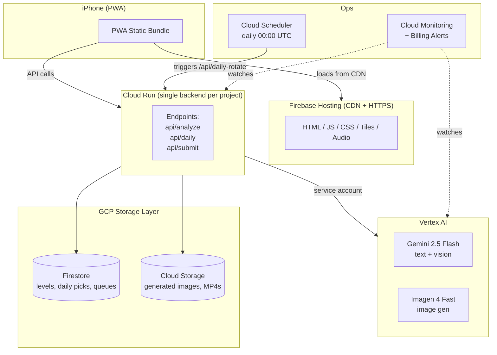
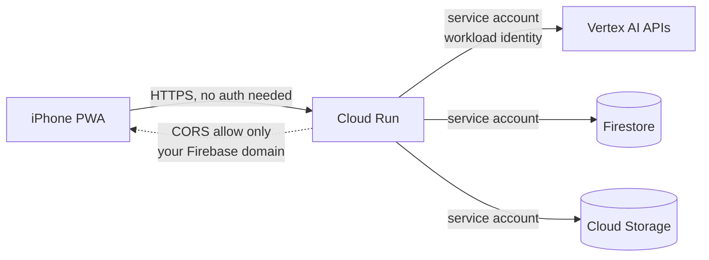
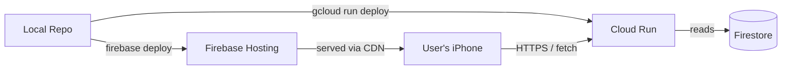
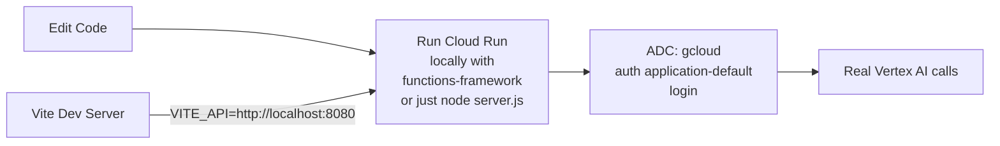

# GCP + Gemini Infrastructure Guide

> _Shared infrastructure playbook for both Reverie and Mirror Realm._

Both projects use the same Google Cloud + Gemini stack so you only learn one set of tools. This guide documents that stack end-to-end: which services, why, how to set them up, how authentication works, what it costs, and how to stay inside free tiers.

---

## Table of Contents

1. [The Stack at a Glance](#1-the-stack-at-a-glance)
2. [Service-by-Service Choices](#2-service-by-service-choices)
3. [Authentication & Security Model](#3-authentication--security-model)
4. [Project Setup Checklist](#4-project-setup-checklist)
5. [Deployment Pattern](#5-deployment-pattern)
6. [Gemini API: Vertex AI vs AI Studio](#6-gemini-api-vertex-ai-vs-ai-studio)
7. [Cost Control & Free-Tier Limits](#7-cost-control--free-tier-limits)
8. [Monitoring & Observability](#8-monitoring--observability)
9. [Local Dev Loop](#9-local-dev-loop)
10. [Useful gcloud Commands](#10-useful-gcloud-commands)

---

## 1. The Stack at a Glance



---

## 2. Service-by-Service Choices

| Concern | Service | Why this one |
|---|---|---|
| Static hosting | **Firebase Hosting** | One-line deploys (`firebase deploy`), free SSL, free CDN, generous free tier (10GB storage, 360MB/day egress). Perfect for PWAs. |
| Backend runtime | **Cloud Run** | Scales to zero, you pay nothing when idle. Container-based so deploy is just a Dockerfile. Free tier covers 2M requests/month — plenty for hobby. |
| Database | **Firestore** (Native mode) | NoSQL, real-time, free tier (1GiB storage, 50k reads/day, 20k writes/day). Trivial to use from Cloud Run via the Admin SDK. |
| File storage | **Cloud Storage** | For larger blobs (generated images, MP4 exports). Free tier 5GB Standard storage. |
| LLM + Vision | **Gemini 2.5 Flash** on Vertex AI | Fast, cheap (~$0.075/1M input tokens), long context, multimodal in one call. Same model handles Reverie's prompt-enrichment and Mirror Realm's photo-to-JSON. |
| Image generation | **Imagen 4 Fast** on Vertex AI | Native to GCP, no extra account, integrates via the same service account as Gemini. Alternative: Flux Schnell on Replicate if you want ~6x cheaper image gen. |
| Cron | **Cloud Scheduler** | Free for 3 jobs/month, pennies after. Hits an HTTPS endpoint on Cloud Run. |
| Monitoring | **Cloud Monitoring** + **Billing Alerts** | Built-in. The billing alert is the single most important safety net. |
| Auth (operator only) | **gcloud CLI** + **OAuth user creds** | You're the only operator; no end-user accounts needed. |
| CI/CD (optional) | **Cloud Build** | Free tier 120 build-minutes/day. Wire to GitHub for auto-deploy. |

### What we explicitly DON'T use

- **No Cloud SQL** — Firestore is enough; SQL adds permanent cost
- **No GKE / Kubernetes** — Cloud Run does everything we need
- **No Cloud Endpoints / API Gateway** — Cloud Run already gives you HTTPS endpoints
- **No Cloud Identity Platform** — no end-user accounts
- **No Cloud Tasks / Pub/Sub** — synchronous Cloud Run is enough at this scale

---

## 3. Authentication & Security Model

The golden rule: **the PWA in the browser never holds any API keys or secrets.** All AI calls go through Cloud Run, which authenticates to Vertex AI using a service account.



### What you'll create per project

| Resource | Purpose |
|---|---|
| One **service account** (`<project>-runtime@…`) | Cloud Run runs as this identity |
| IAM role: `roles/aiplatform.user` | Lets it call Gemini + Imagen |
| IAM role: `roles/datastore.user` | Lets it read/write Firestore |
| IAM role: `roles/storage.objectAdmin` (scoped to one bucket) | Lets it write generated images |
| **CORS config** on Cloud Run | Only your Firebase Hosting domain can call the backend |
| Optional: **App Check** | Adds anti-abuse on top of CORS for the public-facing endpoints |

### Why this matters

Without this setup, anyone could open DevTools, copy your API key, and burn your entire monthly Gemini budget in an afternoon. With this setup, even if someone scrapes your frontend they can only call your backend through your origin — and your backend has rate-limits and a hard monthly cap.

---

## 4. Project Setup Checklist

Do this once per app (Reverie and Mirror Realm get their own GCP project; cleaner billing, blast-radius isolated).

```text
[ ] 1. Create a new GCP project: e.g. "reverie-prod"
[ ] 2. Link a billing account
[ ] 3. Enable required APIs:
       - run.googleapis.com         (Cloud Run)
       - aiplatform.googleapis.com  (Vertex AI: Gemini + Imagen)
       - firestore.googleapis.com   (Firestore)
       - storage.googleapis.com     (Cloud Storage)
       - cloudscheduler.googleapis.com (Cron, only Mirror Realm)
       - cloudbuild.googleapis.com  (optional CI/CD)
[ ] 4. Create Firestore database in Native mode, pick region (e.g. asia-southeast2 for Jakarta)
[ ] 5. Create one Cloud Storage bucket: <project>-blobs
[ ] 6. Create service account: <project>-runtime@<project>.iam.gserviceaccount.com
[ ] 7. Grant IAM roles to that service account (see table above)
[ ] 8. Install Firebase CLI, run `firebase init hosting` in your repo
[ ] 9. Set up billing alert at 50%, 90%, 100% of your monthly cap
[ ] 10. (Recommended) Set a hard budget cap with a Pub/Sub kill-switch
```

One-liner to enable APIs once you have `gcloud` set up:

```bash
gcloud services enable \
  run.googleapis.com \
  aiplatform.googleapis.com \
  firestore.googleapis.com \
  storage.googleapis.com \
  cloudscheduler.googleapis.com \
  cloudbuild.googleapis.com
```

---

## 5. Deployment Pattern

Both projects follow the same shape: PWA frontend deployed to Firebase Hosting, Node/Bun backend in a container on Cloud Run.



### Frontend deploy (single command)

```bash
# from your project root
npm run build
firebase deploy --only hosting
```

### Backend deploy (single command, builds container on the fly)

```bash
gcloud run deploy reverie-api \
  --source ./backend \
  --region asia-southeast2 \
  --service-account reverie-runtime@reverie-prod.iam.gserviceaccount.com \
  --allow-unauthenticated \
  --set-env-vars="GEMINI_PROJECT=reverie-prod,GEMINI_LOCATION=asia-southeast2" \
  --max-instances 5 \
  --memory 512Mi
```

The `--max-instances 5` is your second safety net (the first being the billing cap). Even under a viral spike, no more than 5 containers run.

---

## 6. Gemini API: Vertex AI vs AI Studio

Google offers Gemini two ways. Pick once, stay consistent.

| | **AI Studio (Google AI)** | **Vertex AI** |
|---|---|---|
| Auth | API key | Service account |
| Pricing | Same | Same |
| Free tier | Yes, generous | Limited |
| Imagen access | No | Yes |
| Data residency / VPC | No control | Full control |
| Best for | 5-minute prototypes | Anything deployed |

**Recommendation for this project**: use **Vertex AI**. You're already on GCP, you want Imagen, and service-account auth means no API key floating around.

### Calling Gemini from Cloud Run (Node example)

```js
import { VertexAI } from '@google-cloud/vertexai';

const vertex = new VertexAI({
  project: process.env.GEMINI_PROJECT,
  location: process.env.GEMINI_LOCATION,
});

const model = vertex.getGenerativeModel({ model: 'gemini-2.5-flash' });

const result = await model.generateContent({
  contents: [{ role: 'user', parts: [{ text: prompt }] }],
  generationConfig: { responseMimeType: 'application/json' }
});
```

That's it. The service account is picked up automatically inside Cloud Run — no key files, no env vars beyond project/location.

### Calling Imagen the same way

```js
import { PredictionServiceClient } from '@google-cloud/aiplatform';

const client = new PredictionServiceClient({
  apiEndpoint: `${LOCATION}-aiplatform.googleapis.com`
});

const response = await client.predict({
  endpoint: `projects/${PROJECT}/locations/${LOCATION}/publishers/google/models/imagen-4.0-fast-generate-001`,
  instances: [{ prompt: enhancedPrompt }],
  parameters: { sampleCount: 1, aspectRatio: '9:16' }
});
```

---

## 7. Cost Control & Free-Tier Limits

### Free tier per service (always-free, not 12-month trial)

| Service | Always-free monthly allotment |
|---|---|
| Cloud Run | 2M requests, 360k vCPU-sec, 180k GiB-sec memory |
| Firestore | 1 GiB storage, 50k reads/day, 20k writes/day, 1 GiB egress |
| Cloud Storage | 5 GB Standard storage, 5k Class A ops, 50k Class B ops |
| Cloud Scheduler | 3 jobs |
| Cloud Build | 120 build-minutes/day |
| Firebase Hosting | 10 GB storage, 360 MB/day egress |
| Vertex AI (Gemini) | No free tier — pay-per-token, but extremely cheap |
| Imagen | No free tier — pay-per-image |

### Per-call cost (Gemini 2.5 Flash, May 2025 pricing — verify before deploy)

| Call type | Cost |
|---|---|
| 500-token text in/out | ~$0.0001 |
| 1 image in (counted as ~258 tokens) + 800 tokens out | ~$0.0003 |
| Imagen 4 Fast image | ~$0.02 |

### Hard safety net: budget alerts + kill switch

```text
Budgets & Alerts in GCP Console:
  - Set monthly budget: e.g. $15
  - Alert thresholds: 50%, 90%, 100%, 120%
  - 100% alert triggers a Pub/Sub message
  - Subscribe Cloud Function that disables billing on the project

Result: even in a runaway loop you cannot spend more than ~$1-2
over your cap before everything halts.
```

[Official guide to the kill-switch pattern.](https://cloud.google.com/billing/docs/how-to/notify)

---

## 8. Monitoring & Observability

You don't need a fancy dashboard for a personal toy, but two things are essential:

1. **Billing alerts** (see above). Non-negotiable.
2. **Cloud Run logs** — already free, viewable in console. Search for errors with `severity>=ERROR`.

Optional but nice:

- **Latency metric** on the `/api/analyze` endpoint — if it creeps above 6s, you'll see it
- **Error rate metric** — Cloud Run gives you 4xx/5xx counts out of the box
- A **custom dashboard** in Cloud Monitoring with two charts: cost-per-day and requests-per-day

---

## 9. Local Dev Loop

You don't want to redeploy to Cloud Run every time you change a line of code. Here's the local loop:



The trick is **Application Default Credentials (ADC)**:

```bash
gcloud auth application-default login
```

This drops a JSON file in `~/.config/gcloud/` that the Vertex AI SDK auto-detects when you run locally. You make real Gemini calls from your laptop, using the same code that will run on Cloud Run. No keys, no shimming.

---

## 10. Useful gcloud Commands

```bash
# See live Cloud Run logs while testing
gcloud run services logs tail reverie-api --region asia-southeast2

# How much have I spent this month?
gcloud billing accounts list
# (then check Console → Billing → Reports for the chart)

# Trigger the daily-rotate manually for Mirror Realm
gcloud scheduler jobs run daily-level-rotate --location asia-southeast2

# Roll back a bad deploy in 5 seconds
gcloud run services update-traffic reverie-api \
  --to-revisions=reverie-api-00012-xxx=100 --region asia-southeast2
```

---

## Appendix — When to consider leaving this stack

You wouldn't outgrow this stack until you had:
- More than **2M backend requests/month** (Cloud Run free tier ends)
- More than **50k Firestore reads/day** (move to provisioned-capacity Firestore or Spanner)
- More than **5 concurrent users on the same instance** (bump `--max-instances`)
- A need for **GPU inference** (Cloud Run now has GPU support, but you'd evaluate Vertex AI custom training/serving)

None of these will happen on a personal toy. If they did, congratulations — you have a product.

---

_End of GCP Infrastructure Guide._
