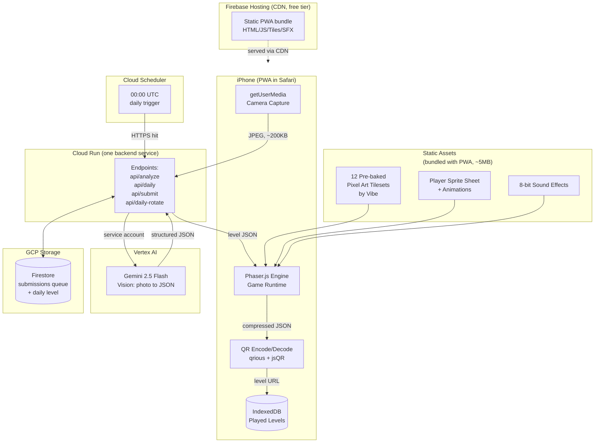
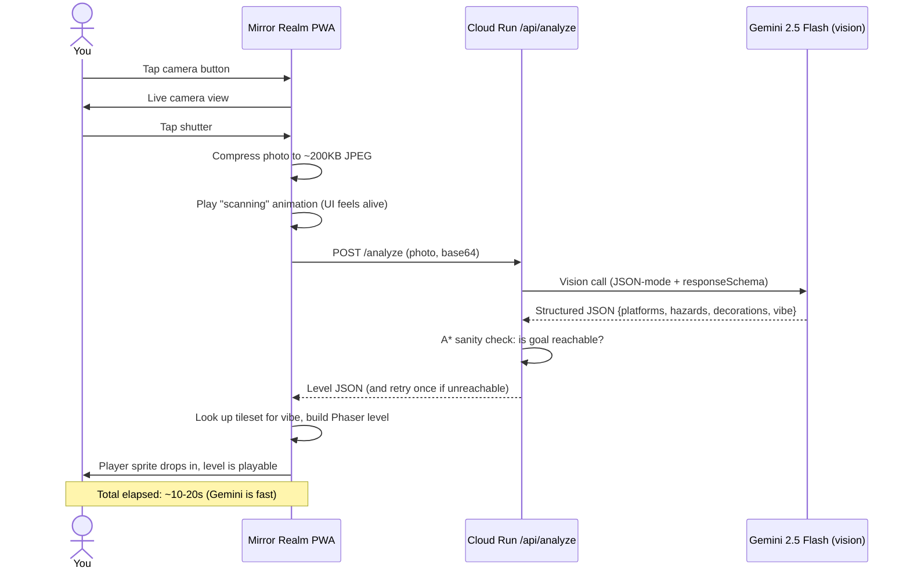
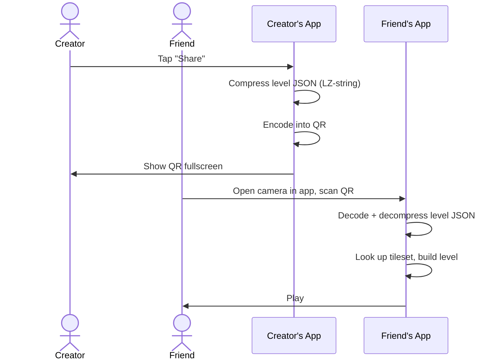
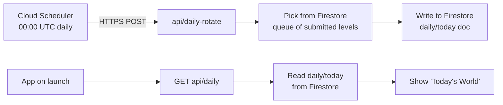
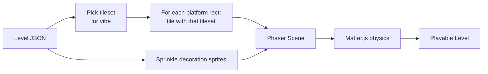

# Mirror Realm — Design Document

> _Photograph reality. Play it as a game._

Point your iPhone at anything — your messy desk, a street, a coffee mug — and within about 30 seconds it becomes a side-scrolling pixel-art platformer of that exact scene. You play it, you die, you laugh, and a QR code lets your friend play **the level you just made.**

> **Infrastructure**: This project runs on Google Cloud and uses Gemini for all LLM + vision calls. The shared infrastructure setup is documented separately in [GCP-Infrastructure-Guide.md](./GCP-Infrastructure-Guide.md). Read that first if you haven't.

---

## Table of Contents

1. [The 30-Second Pitch](#1-the-30-second-pitch)
2. [What It Feels Like](#2-what-it-feels-like)
3. [Design Pillars](#3-design-pillars)
4. [System Architecture](#4-system-architecture)
5. [Core User Flows](#5-core-user-flows)
6. [Low-Fi Wireframes](#6-low-fi-wireframes)
7. [The Vision-to-Level Trick](#7-the-vision-to-level-trick)
8. [Tech Stack](#8-tech-stack)
9. [Resources, Assets, APIs](#9-resources-assets-apis)
10. [Cost Estimate](#10-cost-estimate)
11. [Build Timeline](#11-build-timeline)
12. [Deployment Limits](#12-deployment-limits)
13. [Risks and Mitigations](#13-risks-and-mitigations)
14. [Stretch Ideas](#14-stretch-ideas)

---

## 1. The 30-Second Pitch

| Field | Value |
|---|---|
| **Genre** | Side-scrolling pixel platformer + procedural level generator |
| **Platform** | PWA (installable to iOS home screen) |
| **Primary device** | iPhone (camera, touch) |
| **Session length** | 1-5 minutes per level, infinite replayability |
| **Magic moment** | The 5 seconds where the photo dissolves into pixel tiles, then a player sprite drops in |
| **Build time** | Two focused weekends with Claude as your pair-programmer |
| **Monthly cost at hobby scale** | Under $10 |

---

## 1.5 Evolution since this doc was written

> _The text below is the **founding vision** (kept intact). This section records how the
> build has **improved** on it. Nothing here abandons the original idea — it extends it.
> Source of truth for current behavior is the `docs/` tree; this is the human summary._

**The magic, expanded — "combine the game AND the photo for more fun."**
The original promise was *photo → dissolves → pixel-art platformer*. We kept that, and added
**multiple experiences** the AI picks per photo (`experience` field on the level):
- **`platformer`** — the original: photo becomes a playable pixel-art level.
- **`pixel`** — a "funny pixel" reveal of the photo itself (posterised pixel art).
- **`animation`** — an animated reveal (Ken-Burns drift + scan-line).

A **playable level is always generated** regardless, so **sharing always opens a playable
game** (the photo never leaves the device for the pixel/animation reveals — privacy intact).
This is an *improvement*, not a pivot: the pixel-art identity and the capture→play→share loop
remain the heart of the app.

**Implementation deltas from the original spec (all intentional):**

| Area | Original doc | Now (current build) |
|---|---|---|
| AI provider | Vertex AI · Gemini 2.5 Flash · workload identity (no keys) | **AI Studio (Gemini Developer API) · `gemini-3.5-flash` · API key** in Secret Manager (one secret holds the full `.env`) |
| Structured output | strict `responseSchema` | **JSON-mode + prompt + Pydantic validation** (Developer API rejects the schema keywords) |
| Backend | Node + Hono | **Python + FastAPI + `google-genai`** |
| Physics | Matter.js | **Arcade physics** (lighter, fine for this platformer) |
| Cost / level | ~$0.001 | **~$0.007–0.015** (3.5-flash); `$1/day` soft cap (~30–60 levels) |
| Daily | submit to *tomorrow's* pool; operator pre-vetting | **1 submission/device/day**; `GET /api/daily` **lazily seeds today** from the queue; reachability auto-validated (no manual approval) |
| Rendering | `image-rendering: pixelated`, Press Start 2P | smoothed (`antialias`) to fix "broken pixel" scaling — **pixel-art remains the identity; crisp rendering is being polished, not dropped** |

> _Changed: 2026-05-23 — reconciled the design doc with the evolved vision (multi-experience
> + AI/stack deltas) per owner direction: "improvement, not change; don't lose the first design."_

---

## 2. What It Feels Like

You're at a café. You open Mirror Realm and point the camera at your half-finished latte sitting next to a stack of books. You tap **Capture.**

The photo freezes on screen. A "scanning" animation sweeps across it — thin neon lines tracing edges, like the AI is "reading" the world. After about 15 seconds, the photo pixelates and fades, replaced by a side-scrolling level: the mug is a cylindrical platform you can stand on top of. The books are a staircase. The saucer is a slope. The background is the wood grain of the table, abstracted into a cozy, painterly tile aesthetic.

A small pixel character drops in from the top. You swipe up to jump them onto the mug. They slip — die — respawn. You laugh. On the third try you make it across all three books and through a goal flag glowing on the right edge.

A QR code slides up. _"Send your friend this level."_ Your friend three thousand kilometers away scans it, plays the same level, beats it in two tries, sends back a screenshot of their score.

The next day you open the app and there's a notification dot on **Daily World**: today's globally shared level is someone's photo of a snowy parking lot in Helsinki, transformed into an icy platforming gauntlet. You play it. You leave a tiny emoji-reaction. That's the whole game.

---

## 3. Design Pillars

1. **Photo to playable in under 30 seconds.** This is the entire promise. Everything else negotiates around it.
2. **The aesthetic is pixel art.** For the platformer, the photo is just structure and the look comes from shipped tilesets (we don't generate them live). _Evolved (see §1.5): the photo can ALSO become the art — the `pixel` and `animation` experiences reveal the photo itself as pixel art / animation. Pixel art stays the identity; we just added "the photo as art" as a second kind of fun._
3. **One tap to share.** A level should be shareable as a QR or a URL. No accounts ever.

---

## 4. System Architecture



### Why this shape

- **Cloud Run is your only backend.** One service, four routes. Scales to zero. Free tier covers 2M req/month — you'll never get close.
- **Service account auth means no API keys in the browser.** PWA only talks to your Cloud Run URL; Cloud Run uses its identity to call Gemini.
- **The aesthetic is shipped, not generated.** The single biggest engineering win: 12 pre-made tilesets cover every photo. Gemini only picks which one. This keeps levels under 2 seconds of work after the vision call.
- **Levels are tiny JSON.** Compressed, a typical level is 300-800 bytes — fits comfortably in a QR code or a URL.
- **Gemini Flash is ~10× cheaper than the equivalent Claude Sonnet vision call**, with effectively the same quality on this layout-extraction task. This is the headline win of moving to Gemini for this project.

---

## 5. Core User Flows

### 5.1 Capture → Play (the main loop)



### 5.2 Share via QR



### 5.3 Daily World



### 5.4 Submission (optional)

After beating a level you made, the app asks: _"Submit to tomorrow's Daily World pool?"_ One tap. No login. The Worker stores it with a hash for dedup.

---

## 6. Low-Fi Wireframes

### 6.1 Home

```
+---------------------------------+
|  MIRROR REALM                   |
|                                 |
|                                 |
|                                 |
|         +-------------+         |
|         |             |         |
|         |   CAMERA    |         |
|         |   (huge)    |         |
|         |             |         |
|         +-------------+         |
|                                 |
|                                 |
|  [ today ]  [ played ]  [ ? ]   |
+---------------------------------+
```

### 6.2 Scanning State

```
+---------------------------------+
|  CAPTURED                       |
|                                 |
|  +---------------------------+  |
|  |                           |  |
|  |     (your photo here)     |  |
|  |     ~~~~ scan line ~~~~   |  |
|  |                           |  |
|  +---------------------------+  |
|                                 |
|  reading the world... ███░░░░░  |
|                                 |
|                       [ cancel ]|
+---------------------------------+
```

### 6.3 In-Game

```
+---------------------------------+
|                          ☆  ☆   | <- coins/decorations
|                                 |
|   ◢◣                            |
|   ◥◤   _____                    |
|        |   |    _______         |
|        |   |   |       | __     |
|        |MUG|   | BOOKS |   |    |
| ===================bg=========  |
|                                 |
| [<]                       [⌃]   |  <- left  / jump
+---------------------------------+
```

### 6.4 Win Screen / Share

```
+---------------------------------+
|         CLEARED!                |
|         00:42                   |
|                                 |
|         ▓▓▓▓▓▓▓▓                |
|         ▓ QR ▓                  |
|         ▓ HERE ▓                |
|         ▓▓▓▓▓▓▓▓                |
|                                 |
|   send to a friend              |
|                                 |
|  [ replay ]  [ submit daily ]   |
+---------------------------------+
```

### 6.5 Visual Direction

| Element | Spec |
|---|---|
| Tile size | 32x32px native, scaled 2x on retina |
| Palette | One palette per vibe (cozy = warm oranges; neon = magenta/cyan; ruined = rusts/grays) |
| Player sprite | 24x32, simple white "spark" character with cape — readable on any background |
| UI | Pixel font (e.g., `Press Start 2P`), high contrast, minimal HUD |
| Camera | Smooth follow with 200ms lookahead; small screen shake on land |

---

## 7. The Vision-to-Level Trick

This is the conceptual heart of the project. Read carefully.

### 7.1 What Gemini Vision returns

You send the photo plus this prompt (and use `responseMimeType: 'application/json'` + a `responseSchema` so Gemini returns valid JSON every time):

```text
You are a level designer for a 2D side-scrolling pixel platformer.
Analyze this photo and return STRICT JSON describing a playable level.

Coordinates: 0,0 is top-left. World is 1920 wide, 540 tall.
Player is 24x32, can jump ~120px high, can move ~250px horizontally.

Return:
{
  "vibe": one of [cozy, neon, ruined, forest, vapor, desert,
                  industrial, snow, underwater, library,
                  cosmic, monochrome],
  "platforms": [{"x":..,"y":..,"w":..,"h":..,"label":"e.g. coffee mug"}, ...],
  "hazards":   [{"x":..,"y":..,"w":..,"h":..,"label":"e.g. hot lamp"}, ...],
  "decorations":[{"x":..,"y":..,"label":"e.g. floating dust"}, ...],
  "spawn": {"x":50, "y":50},
  "goal":  {"x":1850, "y":..}
}

Rules:
- 4-12 platforms.
- At most 3 hazards (keep beatable).
- Make sure a sequence of jumps from spawn to goal is physically possible.
```

### 7.2 What the app does with it



The point: **Gemini does the layout, your tilesets do the look.** This is what makes the result consistently beautiful instead of consistently weird.

### 7.3 Why this works

- Vision models are great at "where are the rectangular regions in this photo" — that's basically platform layout.
- Vision models are NOT consistent at producing pretty pixel art live — so we don't ask them to.
- Pre-baked tilesets are made *once* (you can generate them with Imagen during dev, or buy them from Kenney/itch.io for $0) and shipped statically.
- Gemini Flash is **fast and cheap** for this kind of structured-JSON extraction task — about $0.001 per call. Sonnet-class quality at Haiku-class price.

---

## 8. Tech Stack

### 8.1 Frontend

| Layer | Choice | Why |
|---|---|---|
| Build tool | **Vite** | Same as Reverie — fast, PWA-ready |
| PWA shell | **vite-plugin-pwa** | Installable on iPhone |
| Game engine | **Phaser 3** | Mature 2D engine, built-in physics, sprite handling, camera |
| Physics | **Matter.js** (bundled with Phaser) | Solid platformer feel out of the box |
| Camera capture | **getUserMedia** + Canvas | Native browser, no library |
| QR encode | **qrious** | 5KB, generates QR canvas |
| QR decode | **jsQR** | 40KB, reads QR from camera frame |
| Compression | **lz-string** | Crunch level JSON small enough to fit in a QR |
| Storage | **IndexedDB** via `idb` | Save played levels, badges |

### 8.2 Backend (GCP)

| Layer | Choice | Why |
|---|---|---|
| Static PWA hosting | **Firebase Hosting** | Free SSL, free CDN, generous free tier, `firebase deploy` one-liner |
| Backend runtime | **Cloud Run** | Scales to zero; container deploy; free tier 2M req/month |
| Storage | **Firestore** (Native mode) | Submissions queue + daily level doc; free tier (1GB, 50k reads/day) |
| Cron | **Cloud Scheduler** | Free for 3 jobs/month; hits Cloud Run on schedule |

For full setup details, see the [GCP Infrastructure Guide](./GCP-Infrastructure-Guide.md).

### 8.3 AI

| Service | Model | Provider | Cost | Latency |
|---|---|---|---|---|
| Vision → level JSON | **Gemini 2.5 Flash** (vision + JSON mode) | Vertex AI | ~$0.001 per call | ~2-5s |

> Notable: this is ~10× cheaper and meaningfully faster than the Claude Sonnet path we originally specced. Same quality on the layout-extraction task because we use `responseSchema` to constrain output.

---

## 9. Resources, Assets, APIs

### 9.1 Free pixel-art tileset sources (this is the gold mine)

| Source | URL | License |
|---|---|---|
| Kenney.nl — Pixel Platformer | https://kenney.nl/assets/pixel-platformer | CC0 |
| Kenney.nl — 1-Bit Pack | https://kenney.nl/assets/1-bit-pack | CC0 |
| Kenney.nl — full asset index | https://kenney.nl/assets | CC0 (use anywhere, even commercially) |
| OpenGameArt 2D platformer tag | https://opengameart.org/art-search-advanced?keys=&field_art_tags_tid_op=or&field_art_tags_tid=platformer | Mixed; filter to CC0 / CC-BY |
| itch.io free game assets — pixel platformer | https://itch.io/game-assets/free/tag-pixel-art/tag-platformer | Per-asset, check each |
| LimeZu free tilesets | https://limezu.itch.io/ | Mostly free, attribution required |

**Recommendation**: start with Kenney's Pixel Platformer pack. It alone has enough variants to fake 3-4 vibes. Fill the rest from itch.io.

### 9.2 Free player sprite + enemy sources

| Source | URL | Notes |
|---|---|---|
| Kenney character pack | https://kenney.nl/assets/platformer-characters-1 | Multiple animated characters, CC0 |
| Penzilla pixel character | https://penzilla.itch.io/hooded-protagonist | CC0, cinematic feel |
| 0x72's 16x16 dungeon pack | https://0x72.itch.io/16x16-dungeon-tileset | CC0, classic look |

### 9.3 Free sound effects + music

| Source | URL | Notes |
|---|---|---|
| Kenney audio | https://kenney.nl/assets/category:Audio | CC0 jumps, coins, deaths |
| Sonniss GDC bundles | https://sonniss.com/gameaudiogdc | Free huge SFX library each year |
| ChipTone (generator) | https://sfbgames.itch.io/chiptone | Make your own 8-bit SFX in browser |
| Pixabay game music | https://pixabay.com/music/search/chiptune/ | Free chiptune backing tracks |

### 9.4 AI tileset generation (if you want custom looks beyond Kenney)

You can generate your own tilesets ONCE during dev using:

| Tool | URL | Notes |
|---|---|---|
| **Imagen 4 on Vertex AI** | https://cloud.google.com/vertex-ai/generative-ai/docs/image/overview | Same GCP project as the runtime; ~$0.04/image; great for stylized tilesets |
| Flux + pixel-art LoRA | https://replicate.com/lucataco/flux-dev-lora | Pass a pixel-art LoRA hash; ~$0.05/image |
| Retro Diffusion (purpose-built) | https://www.retrodiffusion.ai/ | Web tool, paid but cheap, optimized for tileable pixel art |
| Pixel It (post-processor) | https://giventofly.github.io/pixelit/ | Free; turns any image into pixel art |

### 9.5 Code libraries (npm)

**Frontend PWA**
```json
{
  "dependencies": {
    "phaser": "^3.80.0",
    "idb": "^8.0.0",
    "lz-string": "^1.5.0",
    "qrious": "^4.0.2",
    "jsqr": "^1.4.0"
  },
  "devDependencies": {
    "vite": "^5.0.0",
    "vite-plugin-pwa": "^0.20.0",
    "firebase-tools": "^13.0.0"
  }
}
```

**Cloud Run backend**
```json
{
  "dependencies": {
    "@google-cloud/vertexai": "^1.0.0",
    "@google-cloud/firestore": "^7.0.0",
    "hono": "^4.0.0"
  }
}
```

### 9.6 References / inspiration

| Reference | URL |
|---|---|
| Phaser 3 examples (start here) | https://phaser.io/examples |
| Phaser platformer tutorial | https://phaser.io/tutorials/making-your-first-phaser-3-game |
| Gemini vision on Vertex AI | https://cloud.google.com/vertex-ai/generative-ai/docs/multimodal/send-multimodal-prompts |
| Gemini JSON-mode + responseSchema | https://cloud.google.com/vertex-ai/generative-ai/docs/multimodal/control-generated-output |
| Cloud Run quickstart (Node) | https://cloud.google.com/run/docs/quickstarts/build-and-deploy/deploy-nodejs-service |
| Firestore Node Admin SDK | https://cloud.google.com/firestore/docs/quickstart-servers |
| Cloud Scheduler → Cloud Run | https://cloud.google.com/scheduler/docs/http-target-auth |
| Firebase Hosting quickstart | https://firebase.google.com/docs/hosting/quickstart |
| getUserMedia docs | https://developer.mozilla.org/en-US/docs/Web/API/MediaDevices/getUserMedia |

---

## 10. Cost Estimate

### 10.1 Per-level marginal cost

| Item | Cost |
|---|---|
| Gemini 2.5 Flash vision call (image ~258 tokens + 800 tokens out) | ~$0.001 |
| Cloud Run invocation | $0 (well within free tier) |
| Firestore write (only for submissions) | $0 (well within free tier) |
| **Total per level** | **~$0.001** |

> Note: this is **~10× cheaper** than the original Cloudflare + Claude Sonnet plan. The cost saving is real and meaningful for a shareable app.

### 10.2 Monthly bill scenarios

| Scenario | Levels/day | Monthly levels | Monthly cost |
|---|---|---|---|
| You alone, casual | 5 | ~150 | **$0.15** |
| You + 20 friends sharing QRs | 100 | ~3,000 | **$3** |
| You demo at a party | 200 in a night | — | **$0.20 that day** |
| Daily World averages 50 plays/day | level cached, no AI re-call | 1,500 plays | **$0** (level is computed once) |
| Surprise viral spike (10k levels in a day) | 10,000 | — | **$10 that day** |

### 10.3 Fixed monthly costs

| Item | Cost |
|---|---|
| Firebase Hosting | $0 (free tier) |
| Cloud Run | $0 (free tier: 2M req/month) |
| Firestore | $0 (free tier: 1GB, 50k reads/day, 20k writes/day) |
| Cloud Scheduler | $0 (free tier: 3 jobs) |
| Custom domain (optional) | ~$1/month amortized |

Set a GCP budget alert with **kill-switch at $10/month** ([details in GCP guide § 7](./GCP-Infrastructure-Guide.md#7-cost-control--free-tier-limits)) and you literally cannot overspend.

---

## 11. Build Timeline

### Weekend 1 — "The Magic Moment"

| Block | Goal |
|---|---|
| Sat AM | Complete one-time GCP setup ([checklist](./GCP-Infrastructure-Guide.md#4-project-setup-checklist)); Vite PWA scaffold; camera capture on iPhone; ship photo to a local mock that returns hard-coded level JSON |
| Sat PM | Render JSON as colored rectangles in Phaser; player sprite; jump physics; reach goal flag. **Demo-able as "rectangle platformer".** |
| Sun AM | Build Cloud Run service (Node + Hono + Vertex AI SDK); call Gemini 2.5 Flash vision with `responseSchema`; return real JSON from a real photo. Test via `gcloud run deploy --source`. |
| Sun PM | Swap colored rectangles for Kenney tilesets; add "scanning" animation; polish the magic loop end-to-end |

**End of weekend 1: photograph anything, play it as a real pixel platformer.**

### Weekend 2 — "Make It Shareable"

| Block | Goal |
|---|---|
| Sat AM | LZ-compress level JSON; QR encode; share flow with Web Share API |
| Sat PM | QR scan flow; play levels from URLs and QRs |
| Sun AM | Firestore-backed daily level; Cloud Scheduler cron to rotate; "Today's World" tab |
| Sun PM | Submission flow (writes to Firestore queue); SFX/music; PWA install polish; win-screen flourish; deploy to Firebase Hosting |

**End of weekend 2: shippable to friends; daily shared level loop is live.**

---

## 12. Deployment Limits

| Limit | Reason | What happens |
|---|---|---|
| ~10,000 levels/month at $10 GCP budget cap | Gemini 2.5 Flash pricing | Cloud Run returns "we're full for the month, play yesterday's level"; budget kill-switch halts billing |
| iOS 14.5+ Safari for camera | Browser API | Android fully supported |
| Levels limited to 1920x540 fixed world | Keeps physics simple; one screen of vertical action | Bigger worlds require horizontal scrolling beyond v1 |
| 12 vibes only | Pre-baked tilesets | If photo doesn't match any, fall back to "cozy" |
| 2M Cloud Run req/month | GCP free tier | More than you'll ever need at hobby scale |
| Cloud Run capped at `--max-instances 5` | Hard ceiling we set | Viral spikes get queued, never bankrupt you |
| 1GB Firestore storage | Free tier | Submissions auto-prune after 30 days; daily level docs are tiny |
| 50k Firestore reads/day | Free tier | 1 read per daily-level fetch; supports ~50k plays/day of Daily World |
| No accounts, no profiles | Intentional simplicity | Friends recognize you by level style, not by name |

**If this ever needed to scale**: bump `--max-instances`, move daily-level reads to Cloud CDN (cached static file in Cloud Storage), and consider Firestore in provisioned-capacity mode. The biggest variable is still vision cost — Gemini Flash is already cheap, but you could swap to a smaller open vision model on Vertex AI Model Garden if needed.

### When would GKE make sense instead of Cloud Run?

For both projects, **Cloud Run is the right answer**: scales to zero, no node management, free tier covers all hobby usage. You'd only consider GKE if you needed:

- **Persistent GPU workloads** (e.g. self-hosting a depth model 24/7 instead of using Replicate)
- **Long-lived WebSocket connections** (e.g. multiplayer with hundreds of concurrent rooms — Cloud Run supports WebSockets but with a 60-minute request cap)
- **Sidecar containers** or complex pod topologies
- **A team already operating GKE clusters** and wanting consistency

None of these apply to v1 of either project. Start on Cloud Run; the lift to GKE later is moderate but clean (same container image, different deploy target).

---

## 13. Risks and Mitigations

| Risk | Likelihood | Mitigation |
|---|---|---|
| Vision call takes >20s and breaks the loop | Low (Gemini Flash is fast) | Show entertaining scanning animation; if >15s, cancel and offer "try a different photo" |
| Generated levels are unbeatable | Medium-high | Validate JSON inside Cloud Run: simulate a quick A* path from spawn to goal. If unsolvable, ask Gemini for a retry with smaller jumps (Gemini supports follow-up turns natively). |
| QR codes too dense to scan reliably | Low | LZ-compress + Base64URL; for big levels, fall back to short URL pointing to a Firestore doc keyed by 6-char hash |
| Camera permission denied | Medium | Allow "demo with a stock photo" mode so the app is usable without permission |
| Vibe mismatch (cozy tileset on neon photo) | Medium | Constrain `vibe` to an enum in the `responseSchema`; if Gemini picks badly, fall back to "cozy" |
| Daily World gets a bad submission | Low | Pre-vet submissions in Firestore queue; you (the operator) approve from a tiny admin page |
| iOS PWA loses camera context | Low-medium | Standard fix: re-init `getUserMedia` on resume; document quirk |
| API key / service account leaks | Very low | No API keys exist in this design — Cloud Run uses workload identity. Rotate the service account if you ever suspect a leak. |
| Cloud Run cold start adds 2-5s on first call of the day | Medium | Set `--min-instances 1` (~$10/month extra) on demo days; otherwise accept the cold start |
| Vertex AI Safety filters block a borderline photo | Low | Catch the safety-filter error in Cloud Run, return friendly "we can't read this scene" message |

---

## 14. Stretch Ideas

Ordered by effort:

- **Level remixing**: combine two photos into one level (top half of one, bottom of another)
- **Time-attack mode**: leaderboard per level (level hash → top times in KV)
- **Co-op QR**: two players, one phone via split touch controls
- **Custom player sprites**: take a selfie → use a tiny image model to pixelate your face onto the sprite
- **Boss levels**: a longer photo (panorama) becomes a multi-screen level
- **Ambient AR**: hold the phone up after beating a level → see the pixelated level overlaid on the real photo using WebXR
- **Sound from the scene**: pass the photo to Gemini with "describe the soundscape" and pick matching SFX dynamically
- **Storyboard mode**: chain 5 photos = 5 levels = a tiny game with a hand-narrated intro

---

## Appendix A — Compressed Level URL format

The PWA is served from Firebase Hosting; backend lives on Cloud Run. Both can be behind a custom domain.

```
https://mirror-realm.web.app/p/N4IgZg9hIFwgxgGwAQGUwBcQA4HsBOAVwBcA...
                              ^ LZ-compressed Base64URL level JSON
```

For levels too long for a QR, Cloud Run stores them in Firestore under a 6-char hash:

```
https://mirror-realm.web.app/l/aB3xQ9
```

The Cloud Run handler:

```js
// POST /api/save
const hash = generateHash(6);
await firestore.collection('levels').doc(hash).set({
  json: compressedLevelJson,
  createdAt: Firestore.FieldValue.serverTimestamp(),
  ttl: Firestore.FieldValue.serverTimestamp() // + 30 days, TTL policy
});
return { url: `https://mirror-realm.web.app/l/${hash}` };
```

Use Firestore's [TTL policies](https://cloud.google.com/firestore/docs/ttl) to auto-prune old levels — no cron needed.

## Appendix C — Gemini 2.5 Flash vision call

```js
import { VertexAI } from '@google-cloud/vertexai';

const vertex = new VertexAI({
  project: process.env.GCP_PROJECT,
  location: process.env.GCP_LOCATION
});

const model = vertex.getGenerativeModel({
  model: 'gemini-2.5-flash',
  systemInstruction: `You are a level designer for a 2D side-scrolling
pixel platformer. Analyze the photo and return STRICT JSON describing
a playable level. Coords: 0,0 top-left, world is 1920x540. Player is
24x32, jumps ~120px, moves ~250px horizontally. 4-12 platforms, max 3
hazards. Ensure spawn-to-goal is physically reachable.`,
  generationConfig: {
    responseMimeType: 'application/json',
    responseSchema: {
      type: 'object',
      properties: {
        vibe: { type: 'string', enum: [
          'cozy','neon','ruined','forest','vapor','desert',
          'industrial','snow','underwater','library',
          'cosmic','monochrome'
        ]},
        platforms: { type: 'array', items: rectSchema },
        hazards:   { type: 'array', items: rectSchema },
        decorations: { type: 'array', items: decorSchema },
        spawn: { type: 'object', properties: {
          x: { type: 'integer' }, y: { type: 'integer' }
        }},
        goal:  { type: 'object', properties: {
          x: { type: 'integer' }, y: { type: 'integer' }
        }}
      },
      required: ['vibe','platforms','spawn','goal']
    }
  }
});

const result = await model.generateContent({
  contents: [{
    role: 'user',
    parts: [
      { inlineData: { mimeType: 'image/jpeg', data: photoBase64 } },
      { text: 'Analyze this photo and produce a level.' }
    ]
  }]
});

const level = JSON.parse(result.response.candidates[0].content.parts[0].text);
```

## Appendix B — Phaser scene scaffold

```js
class LevelScene extends Phaser.Scene {
  init(data) { this.level = data.level; }

  preload() {
    // tileset for the vibe Gemini returned
    this.load.image('tiles', `/tilesets/${this.level.vibe}.png`);
    this.load.spritesheet('player', '/sprites/spark.png', 
                          { frameWidth: 24, frameHeight: 32 });
  }

  create() {
    // for each platform rect, blit tiles
    this.level.platforms.forEach(p => this.buildPlatform(p));
    this.level.hazards.forEach(h => this.buildHazard(h));
    this.level.decorations.forEach(d => this.buildDecor(d));

    this.player = this.physics.add.sprite(
      this.level.spawn.x, this.level.spawn.y, 'player'
    );
    this.physics.add.collider(this.player, this.platformsGroup);
    this.physics.add.overlap(this.player, this.hazardsGroup, () => this.die());
    this.physics.add.overlap(this.player, this.goal, () => this.win());

    this.cameras.main.startFollow(this.player, true, 0.1, 0.1);
  }

  update() {
    // touch controls
  }
}
```

## Appendix C — The 12 vibes (your tileset shopping list)

| Vibe | Source (free) |
|---|---|
| cozy | Kenney Pixel Platformer (default warm palette) |
| neon | LimeZu Modern Interiors (cyberpunk recolor) or recolor Kenney |
| ruined | OpenGameArt "Dark Castle" |
| forest | Kenney Platformer Forest Pack |
| vapor | Recolor of cozy with `hue-rotate(180deg)` filter |
| desert | Kenney Platformer Desert |
| industrial | OpenGameArt "Industrial Tiles" |
| snow | Kenney Platformer Snow |
| underwater | Kenney Platformer Water variants |
| library | Custom: recolor cozy + bookshelf decorations from itch |
| cosmic | Generate ONCE with Flux + pixel-art LoRA, pass: "tileable cosmic pixel art platforming tileset" |
| monochrome | Kenney 1-Bit Pack |

---

_End of Mirror Realm Design Document._
