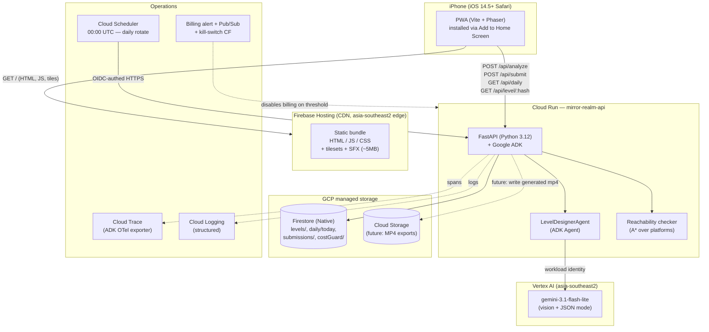
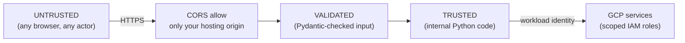
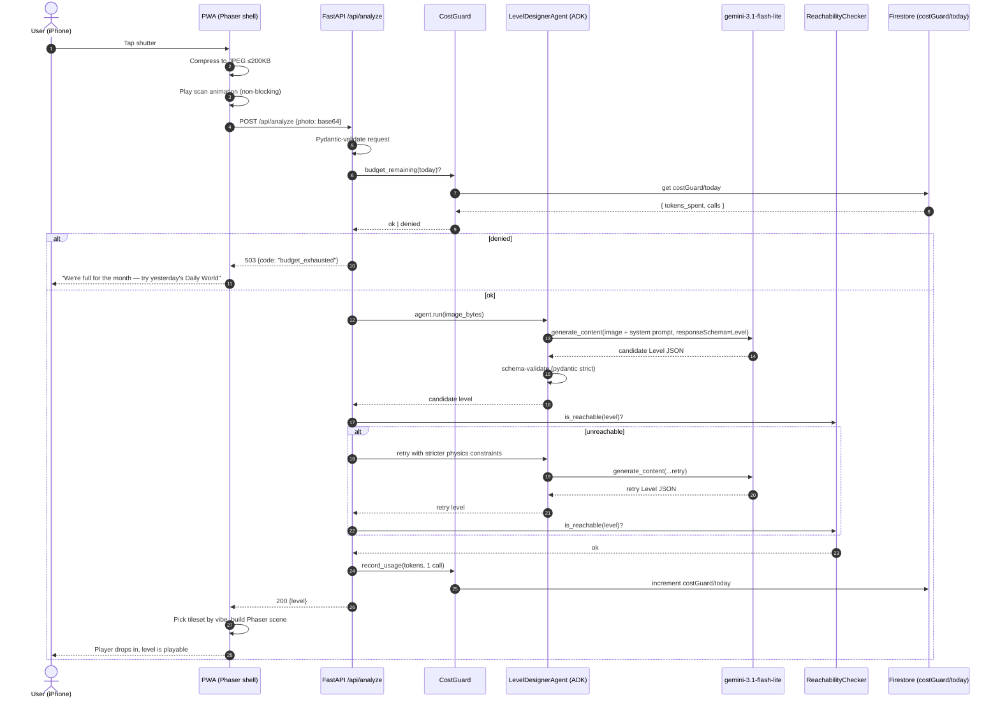
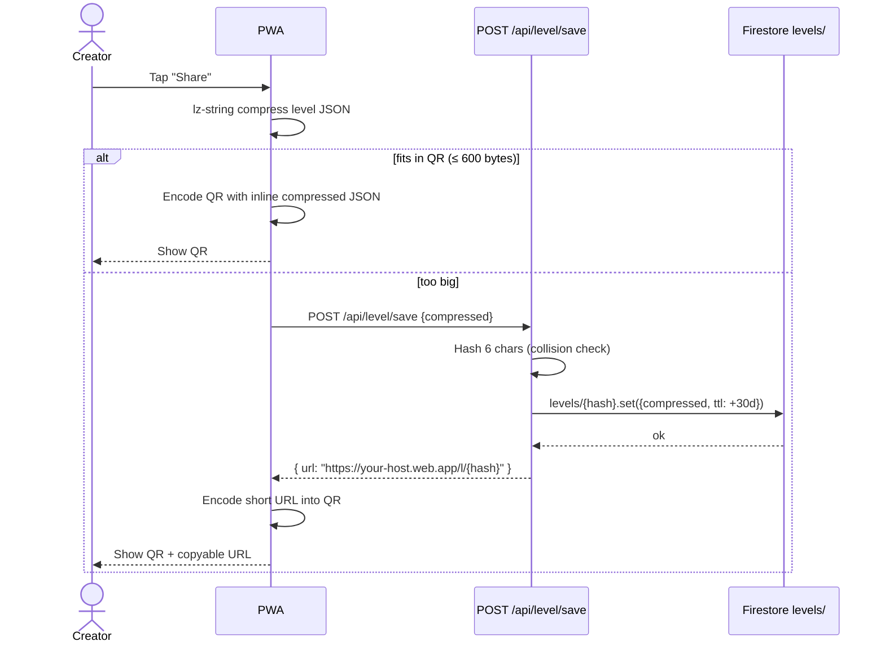
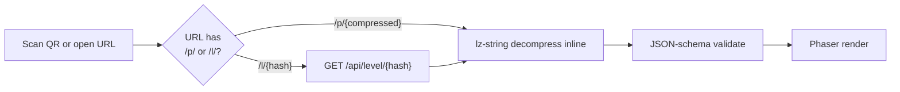
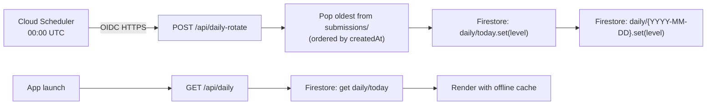
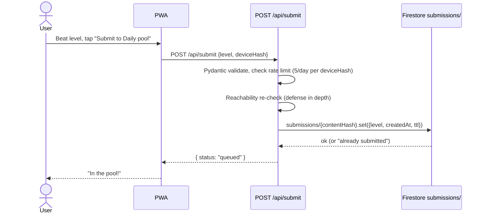

# 01 — Architecture

> **Status**: normative · **Owner**: project lead · **Last revised**: 2026-05-20

How the system is wired. Topology, request flows, failure modes, and the boundaries between layers.

---

## Table of Contents

1. [Topology](#topology)
2. [Layer responsibilities](#layers)
3. [Trust boundaries](#trust)
4. [Primary request flow — capture to play](#flow-capture)
5. [Secondary flows](#flow-secondary)
6. [Failure modes](#failures)
7. [Why this shape (and not the alternatives)](#why)

---

## 1. Topology

Single backend, single LLM, two GCP storage primitives. No queues, no caches, no API gateway. Every box on this diagram is justified in [`03-tech-stack.md`](./03-tech-stack.md); every box NOT on it is explicitly rejected in [`00-overview.md#non-goals`](./00-overview.md#non-goals).

## 2. Layer responsibilities

| Layer | Responsibility | Forbidden from |
|---|---|---|
| **PWA (`apps/web`)** | Camera capture, JPEG compression, UI/UX, Phaser game runtime, QR encode/decode, IndexedDB local cache | Calling Vertex directly; storing secrets; persisting submissions; running reachability check |
| **API (`apps/api`)** | HTTP routing, request validation, ADK agent orchestration, reachability check, Firestore I/O, response shaping, cost-guard enforcement | UI logic; bundling static assets; storing per-user state |
| **Agent layer (`apps/api/app/agents`)** | Prompt management, schema-constrained Gemini calls, retry with stricter constraints | Direct HTTP routing; Firestore reads outside of context-prep tools |
| **Shared schemas (`packages/shared`)** | JSON Schema for Level + Vibe metadata, codegen sources for Pydantic and TS types | Containing executable code; depending on any framework |
| **Infra (`infra/`)** | Deploy scripts, Cloud Build config, Firebase config, IAM role lists | Application logic |

**The golden rule**: contracts cross layer boundaries only via files in `packages/shared/`. If two layers need to agree on a shape, that shape lives there.

## 3. Trust boundaries

Three trust zones. Rules:

1. **Browser → API**: anything the browser sends is untrusted until Pydantic-validated. The CORS allowlist only stops casual cross-origin abuse; it is **not** an auth mechanism. If we ever need real anti-abuse, App Check goes here ([`13-security.md`](./13-security.md)).
2. **API → Vertex**: workload identity. No keys. The Cloud Run service account has exactly `roles/aiplatform.user` + `roles/datastore.user` + scoped `roles/storage.objectAdmin`. Audit: [`13-security.md#iam`](./13-security.md#iam).
3. **API → Firestore**: same workload identity. Security rules on Firestore are configured to deny all client-direct access — the only writer is the Cloud Run SA.

The PWA never holds anything secret. Concretely: the bundle's network surface is `GET https://<api>/api/*` + image fetches from Firebase Hosting. Anything else in the bundle is a bug.

## 4. Primary request flow — capture to play

This is C1 from the overview. The sequence that defines the product.

Hard limits encoded in this flow:

- **Single retry only.** If retry also fails reachability, we return the retry level anyway with a flag `wasUnreachableOnFirstAttempt: true` so the client can show a hint. We do not loop indefinitely.
- **Timeouts**: agent call has a 25s wall clock; reachability check has 200ms wall clock. Hard fail outside those.
- **No image stored.** The photo is processed in memory and discarded. We never write the source image to GCS or Firestore.

## 5. Secondary flows

### 5.1 Share via short URL (C3)

### 5.2 Open shared level (C4)

### 5.3 Daily World (C5 + C7)

### 5.4 Submit (C6)

## 6. Failure modes

Defensive design — what fails, what we do, what the user sees.

| Failure | Detection | Response | User experience |
|---|---|---|---|
| Gemini returns invalid JSON (despite responseSchema) | Pydantic raises | Single retry with stricter prompt | 1-2s extra latency; transparent |
| Gemini returns unreachable level twice | A* fails after retry | Return retry anyway with `wasUnreachableOnFirstAttempt` flag | Subtle "tricky one!" badge |
| Gemini exceeds 25s wall clock | asyncio timeout | Return 504; client offers "try a different photo" | "Reading taking too long" |
| Safety filter blocks photo | Vertex returns safety-block error code | Return 422 with reason | "We can't read this scene" |
| Firestore unavailable | Google API error | Return 503; client suggests retry | "Database hiccup, try again" |
| Cost guard tripped | Daily limit exceeded | Return 503 `budget_exhausted` | "We're full — play Daily World" |
| Cloud Run cold start | First request of the day | Accept the 2-5s delay | Scan animation absorbs latency |
| iOS PWA loses camera context (suspended tab) | `getUserMedia` error on resume | Re-init camera | Brief reload state |
| QR scan returns garbage | jsQR decode + JSON validate fails | Show "invalid QR" toast | "Doesn't look like a Mirror Realm level" |
| Daily/today missing (cron didn't run) | Firestore returns nothing | Fall back to yesterday's archive | Tiny "yesterday's pick" label |

There is no retry loop wrapping the agent at the request boundary — retries live **inside** the agent layer with explicit caps. If the API endpoint returns an error, the client treats it as terminal.

## 7. Why this shape (and not the alternatives)

| Choice | Alternative we considered | Why we picked this |
|---|---|---|
| **One Cloud Run service, four routes** | Multiple services per concern | Free-tier ceilings are per-service; one service maximizes free headroom and simplifies deploys |
| **FastAPI + ADK in Python** | Node/Hono (per design doc) | ADK is Python-native; tracing is built in; agent abstractions are cleaner |
| **Firestore (Native) for everything** | Cloud SQL / Spanner | Always-free tier; serverless; trivial Python client |
| **One agent class (`LevelDesignerAgent`)** | Multi-agent / tool-using setups | v1 has one job — extract layout JSON. Don't over-architect. |
| **Pre-baked tilesets** | Imagen at request time | 10× cost saving; visual consistency; <1s render |
| **lz-string + inline-in-QR fallback to short URL** | URL-only | QRs work fully offline (in-app share without a network round-trip) |
| **Workload identity, no keys** | API keys in env | Eliminates an entire class of leak |
| **No queues / Pub/Sub** | Pub/Sub between API and agent | Synchronous is fine at scale ≤5 concurrent users |

When in doubt, the simplest GCP-native option wins. We add complexity only when a success criterion in [`00-overview.md`](./00-overview.md#success-criteria) demands it.

---

_End of 01 — Architecture._
