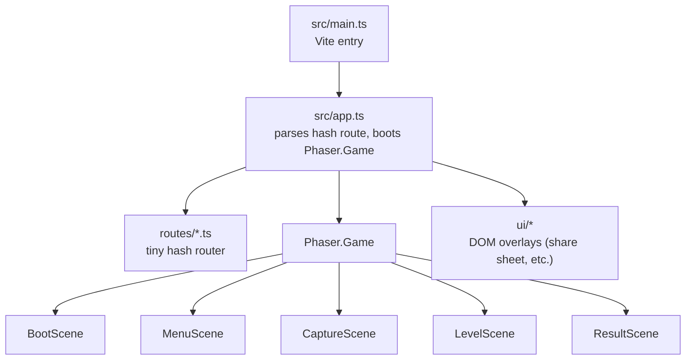
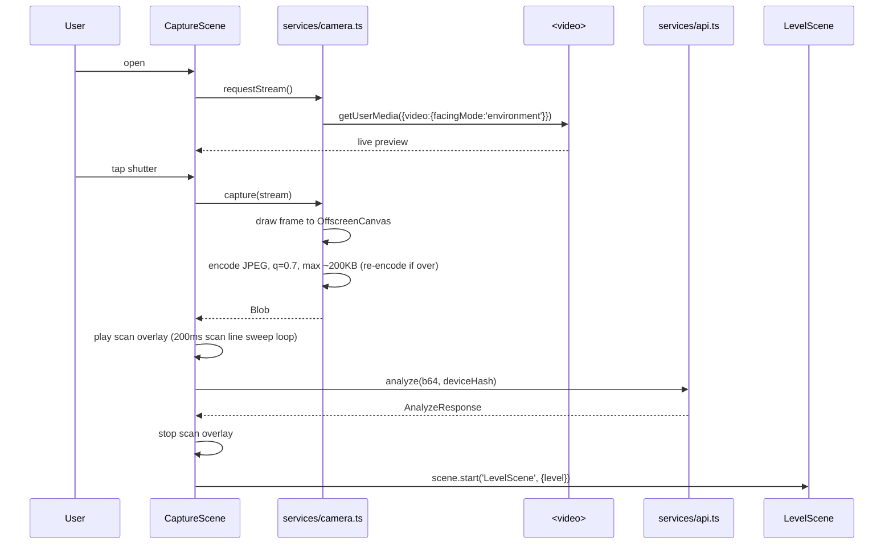
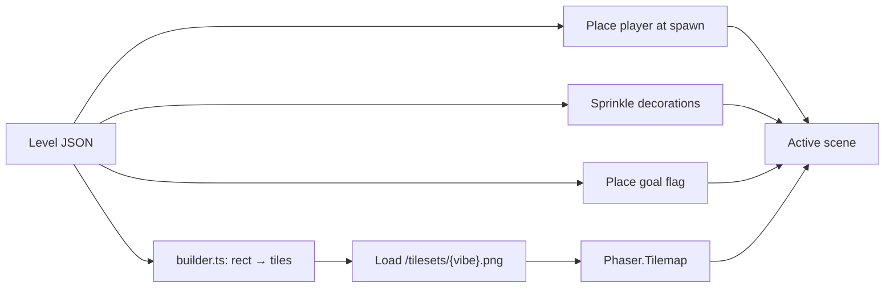

# 08 — Frontend App

> **Status**: normative · **Owner**: project lead · **Last revised**: 2026-05-20

The PWA layer — what `apps/web` actually does. Phaser scene tree, routes, the camera pipeline, IndexedDB cache, sharing UI, and the rules that keep the bundle iPhone-friendly.

---

## Table of Contents

1. [Runtime structure](#runtime)
2. [Routing](#routing)
3. [Phaser scenes](#scenes)
4. [Services (`src/services/`)](#services)
5. [Camera + scan animation](#camera)
6. [Level rendering pipeline](#rendering)
7. [Touch controls](#controls)
8. [Sharing UI (QR + URL)](#sharing)
9. [Offline cache](#offline)
10. [PWA install + iOS quirks](#pwa)

---

<a id="runtime"></a>

## 1. Runtime structure



- One `Phaser.Game` instance for the whole app lifecycle.
- Scenes are pushed/popped; only one is active at a time.
- DOM overlays (`ui/`) sit *above* the Phaser canvas (z-indexed). They're used for things Phaser is bad at: native share sheet, QR scan camera viewport (which reuses our `services/camera.ts`).
- All cross-scene state goes through `Phaser.Registry` (game-scoped key-value); no global variables.

<a id="responsive"></a>

### Responsive sizing

> _Changed: 2026-05-22 — moved from a fixed 960×540 `Scale.FIT` canvas (which
> letterboxed to a tiny band in portrait on phones) to `Scale.RESIZE`._

- The game uses **`Phaser.Scale.RESIZE`**: the canvas always fills the viewport in
  CSS pixels, in portrait or landscape, with no letterboxing.
- Scenes read `this.scale.{width,height}` and re-layout through the **`onResize(scene, cb)`**
  helper in `app.ts` (debounced via `requestAnimationFrame`, auto-removed on scene
  shutdown, fires once immediately so there is a single layout path).
- The world model stays **1920×540 logical px** (`WORLD_W`/`WORLD_H`). `LevelScene`
  sets the camera zoom to `viewportHeight / WORLD_H` so the full world height is always
  on screen and the camera follows the player horizontally.
- In-canvas HUD hints that would distort under camera zoom go through the DOM `toast`
  layer instead.

> _Changed: 2026-05-22 — camera + share-sheet robustness:_
> - _**Camera fallback:** the live camera (`getUserMedia`) needs a secure context (HTTPS
>   or localhost). When unavailable (e.g. plain-HTTP LAN), `CaptureScene` switches to
>   `captureFromFile()` — a tap anywhere on the overlay opens the OS photo/camera picker.
>   The picker must open from a real DOM gesture (the overlay's own listener), not a
>   Phaser input event (those are processed in the game loop, after the gesture)._
> - _**Share sheet** scrolls (`overflow-y:auto` + `align-items: safe center`) so the QR /
>   Replay never crop on short landscape viewports; the share URL is a clickable,
>   ellipsised `<a>`._
> - _**Share links** prefer a SHORT `${location.origin}/l/<hash>` (minted via `saveLevel`
>   on the current origin, so it works locally and in prod) — this keeps the QR
>   low-density (the long inline `/p/<base64>` made the QR tiny in its canvas). Inline is
>   the offline fallback only. Copy uses a `textarea`+`execCommand` fallback because
>   `navigator.clipboard`/`navigator.share` need a secure context (unavailable on LAN http)._
> - _The **About** panel is a scrollable DOM overlay (not Phaser text) so it never crops
>   on rotate._
> - _Rendering uses `antialias: true` (not `pixelArt`) so 2x-source art scales smoothly._

<a id="routing"></a>

## 2. Routing

We use **hash-based routing** (`#/play?source=qr`), not the History API. Two reasons:
1. Firebase Hosting doesn't need a wildcard rewrite to handle deep links.
2. Hash routes survive iOS PWA's quirky URL handling.

```ts
// apps/web/src/app.ts (excerpt)
// docs: 08-frontend-app.md#routing
type Route =
  | { name: 'home' }
  | { name: 'capture' }
  | { name: 'play'; source: 'fresh' | 'qr' | 'daily' | 'short'; payload?: string }
  | { name: 'daily' }
  | { name: 'share'; levelEncoded: string };

function parseHash(hash: string): Route {
  // ...routes hash like #/play?source=short&payload=aB3xQ9
}
```

### URL surface (consumed by Firebase Hosting)

| Path | Purpose | Routes to |
|---|---|---|
| `/` or `/#/` | Home | `MenuScene` |
| `/#/capture` | Camera capture flow | `CaptureScene` |
| `/#/play` | Play current level | `LevelScene` (level read from `Phaser.Registry`) |
| `/#/daily` | Fetch + play today's daily | `LevelScene` after `GET /api/daily` |
| `/p/<lzCompressedJson>` | Play a level inlined in URL | parse → `LevelScene` |
| `/l/<6charHash>` | Play a server-stored level | `GET /api/level/<hash>` → `LevelScene` |

`/p/*` and `/l/*` are real Firebase Hosting rewrites in `infra/firebase.json` — they serve `index.html` for any prefix and the SPA parses the rest.

<a id="scenes"></a>

## 3. Phaser scenes

| Scene | Lifecycle | Key responsibilities |
|---|---|---|
| `BootScene` | First | Preload absolutely-required assets (logo, font, splash); transition to `MenuScene` |
| `MenuScene` | Default landing | Three buttons (Camera / Today / About); idle attract animation |
| `CaptureScene` | Pushed from menu | Mount `<video>` element, draw scan overlay, POST `/api/analyze`, transition to `LevelScene` on success |
| `LevelScene` | The game | Build tile grid from `Level` JSON, run physics, handle input, fire `level:win` / `level:die` events |
| `ResultScene` | Modal-style overlay over `LevelScene` | Win/lose card; share + replay + submit-to-daily buttons |
| `PixelScene` / `AnimationScene` | Reveal (extend `RevealScene`) | Non-game experiences — render the captured photo with an effect, then PLAY / SHARE / AGAIN |

<a id="experiences"></a>

### Experiences (variant routing)

> _Added: 2026-05-23 — a photo can yield one of three experiences; the AI picks which via
> the `experience` field on the Level (`platformer` | `pixel` | `animation`)._

- The **playable level is ALWAYS generated**, whatever `experience` is chosen. `experience`
  only decides what `CaptureScene` shows *first*:
  - `platformer` → `LevelScene` (the game).
  - `pixel` → `PixelScene` — the captured photo, pixelated (Phaser postFX).
  - `animation` → `AnimationScene` — the photo with a Ken-Burns drift + scan-line sweep.
- **Privacy:** for `pixel`/`animation` the captured photo is rendered **on-device** (passed
  scene→scene in memory, never uploaded). Nothing about the photo is stored server-side.
- **Sharing always shares the level** (abstract data, no image) via `RevealScene`'s SHARE
  button → `ShareSheet`. So a shared link always opens a *playable* game, never a dead-end
  image — the reveal is the local "wow", the game is the shareable hook.
- Both reveal scenes extend `RevealScene` (`src/scenes/RevealScene.ts`), which loads the
  photo as a texture, lays out a vibe-framed image + title + CTA row, and re-layouts on
  resize. Subclasses implement `applyEffect(img)`.

```ts
// apps/web/src/scenes/LevelScene.ts (skeleton)
// docs: 08-frontend-app.md#scenes
import Phaser from 'phaser';
import type { Level } from '../domain/level';
import { buildLevel } from '../game/builder';
import { GRAVITY, JUMP_VEL, MOVE_VEL, PLAYER_W, PLAYER_H } from '../game/physics';

export class LevelScene extends Phaser.Scene {
  private level!: Level;
  private player!: Phaser.Physics.Arcade.Sprite;
  private platformsGroup!: Phaser.Physics.Arcade.StaticGroup;
  private hazardsGroup!: Phaser.Physics.Arcade.StaticGroup;
  private goal!: Phaser.Physics.Arcade.StaticBody;

  init(data: { level: Level }) {
    this.level = data.level;
  }

  preload() {
    this.load.image('tiles', `/tilesets/${this.level.vibe}.png`);
    this.load.spritesheet('player', '/sprites/spark.png', { frameWidth: PLAYER_W, frameHeight: PLAYER_H });
    // SFX ship as generated .wav (docs/03 §assets); audio is best-effort.
    this.load.audio('sfx-jump', '/sfx/jump.wav');
    this.load.audio('sfx-die', '/sfx/die.wav');
    this.load.audio('sfx-win', '/sfx/win.wav');
  }

  create() {
    this.physics.world.gravity.y = GRAVITY;
    ({ platformsGroup: this.platformsGroup, hazardsGroup: this.hazardsGroup, goal: this.goal } =
       buildLevel(this, this.level));

    this.player = this.physics.add.sprite(this.level.spawn.x, this.level.spawn.y, 'player');
    this.physics.add.collider(this.player, this.platformsGroup);
    this.physics.add.overlap(this.player, this.hazardsGroup, () => this.die());
    this.physics.add.overlap(this.player, this.goal, () => this.win());

    this.cameras.main.startFollow(this.player, true, 0.1, 0.1);
  }

  update() {
    // touch + keyboard input → set velocity / jump impulse
  }

  private die() { this.scene.launch('ResultScene', { outcome: 'die' }); }
  private win() { this.scene.launch('ResultScene', { outcome: 'win' }); }
}
```

The `buildLevel` helper (in `src/game/builder.ts`) translates the abstract Level rects into Phaser tiles by sampling the tileset.

> _Changed: 2026-05-21 — `buildLevel` tiles each rect into a `Phaser.Physics.Arcade.StaticGroup` of 32px tile sprites (frames chosen by the 9-slice picker in `tile-mapping.ts`) rather than a `Tilemap`. At 4–12 platforms the render cost is negligible and the static-group path is simpler and collision-ready. Revisit the `Tilemap` route if levels ever grow large._

<a id="services"></a>

## 4. Services (`src/services/`)

One file per external integration. No service imports another service.

| Service | Public API |
|---|---|
| `api.ts` | `analyze(photo, deviceHash)`, `saveLevel(level, deviceHash)`, `getLevel(hash)`, `submit(level, deviceHash)`, `getDaily()` |
| `camera.ts` | `streamSupported()`, `requestStream()`, `capture(video): string`, `captureFromFile(): Promise<string>`, `release(stream)` — base64 JPEG ≤200KB |
| `storage.ts` | `loadCache<T>(key)`, `saveCache<T>(key, value, ttl)`, `getOrCreateDeviceHash(): string` (random 16 bytes hex, persisted) |
| `qr.ts` | `encode(text): Promise<HTMLCanvasElement>`, `decodeFromVideo(video): AsyncIterable<string>` |
| `compression.ts` | `compress(level): string` (lz-string base64url), `decompress(s): Level \| null` |

```ts
// apps/web/src/services/api.ts (excerpt)
// docs: 08-frontend-app.md#services
const BASE = import.meta.env.VITE_API_BASE_URL ?? 'http://localhost:8080';

export async function analyze(photoB64: string, deviceHash: string): Promise<AnalyzeResponse> {
  const res = await fetch(`${BASE}/api/analyze`, {
    method: 'POST',
    headers: { 'Content-Type': 'application/json' },
    body: JSON.stringify({ photo: photoB64, deviceHash }),
    signal: AbortSignal.timeout(27_000),  // server is 25s; client adds 2s margin
  });
  if (!res.ok) throw await toApiError(res);
  return await res.json();
}
```

Error handling pattern: every service rejects with a typed `ApiError` matching the [§10 envelope](./07-api-contracts.md#errors). UI layer maps `code` to user-facing copy.

<a id="camera"></a>

## 5. Camera + scan animation



### JPEG compression rule

The server cap is 200KB *after* base64 (~ 150KB raw). Algorithm:

1. Capture full-res frame → OffscreenCanvas.
2. Downscale to 1280px on the longer edge.
3. Encode JPEG at q=0.7. If output > 200KB, lower q in 0.1 steps to 0.4. If still over, downscale to 1024px and repeat.
4. If we somehow can't get under 200KB at q=0.4 + 1024px, show "Photo too complex — try another."

We don't ship a WASM image codec; the canvas implementation in Mobile Safari is plenty.

<a id="rendering"></a>

## 6. Level rendering pipeline



Tile sampling: each platform rect is broken into 32×32 cells; corner / edge / fill tiles are picked from the tileset using a 9-slice convention. The mapping table (`apps/web/src/game/tile-mapping.ts`) is the same for all vibes — only the source PNG changes.

Decorations: positioned as `Image` objects (no physics). They're purely visual.

Camera: smooth follow with 200ms lookahead; small screen shake on land (Phaser camera shake of magnitude 0.005, duration 80ms).

<a id="controls"></a>

## 7. Touch controls

```
+----------------------------------+
|                                  |
|  game viewport (fullscreen)      |
|                                  |
|                                  |
|  [<]                       [⌃]   |  ← thumb targets, 64x64 each
+----------------------------------+
```

- **Left half** of screen: tap & hold = move left; release = stop.
- **Right half**: tap & hold = move right; release = stop.
- **Anywhere swipe-up** (Δy < -40px in 200ms): jump.
- **Keyboard fallback** (for desktop dev): ← → and Space.

Implementation in `src/game/controls.ts`. Uses `Phaser.Input.Pointer` for multi-touch (you can move + jump at once).

Coyote frames: `COYOTE_FRAMES = 6` lets the player jump for ~100ms after walking off a ledge. Same constant as the physics doc — kept in sync.

<a id="sharing"></a>

## 8. Sharing UI (QR + URL)

After winning, `ResultScene` shows a share sheet (DOM overlay, not Phaser):

```
+--------------------------------+
|         CLEARED in 00:42       |
|                                |
|   [   QR code canvas (256px) ] |
|                                |
|   https://<your-host>.web.app  |
|   /p/N4IgZg9hIFwgxgGwAQGUwBcQ… |
|                                |
|   [Copy URL]   [Native Share]  |
|   [Replay]     [Submit Daily]  |
+--------------------------------+
```

### Encode flow

```ts
// apps/web/src/ui/ShareSheet.ts (excerpt)
// docs: 08-frontend-app.md#sharing
import { compress } from '../services/compression';
import { encode as qrEncode } from '../services/qr';
import { saveLevel } from '../services/api';

async function buildShareUrl(level: Level, deviceHash: string): Promise<string> {
  const inline = compress(level);
  if (inline.length <= 600) {
    // location.origin keeps share URLs aligned with whatever host the PWA is served from.
    return `${location.origin}/p/${inline}`;
  }
  const { url } = await saveLevel(level, deviceHash);
  return url;
}
```

Native share uses `navigator.share()` when available; falls back to clipboard copy.

<a id="offline"></a>

## 9. Offline cache

The PWA is mostly online-only — you need the API for the capture flow. But two things are cached for offline:

| Asset | Cache strategy |
|---|---|
| Static assets (HTML/JS/CSS/tilesets/sfx) | Workbox precache (vite-plugin-pwa) |
| Today's daily level (`GET /api/daily`) | Stale-while-revalidate; stored in IndexedDB after first fetch |
| Played levels (from `/p/` or `/l/`) | Saved to IndexedDB on first successful play; replay works offline |

`services/storage.ts` exposes a `levelHistory` table:

```ts
// apps/web/src/services/storage.ts (excerpt)
// docs: 08-frontend-app.md#offline
interface PlayedLevelRecord {
  id: string;           // contentHash
  level: Level;
  source: 'fresh' | 'qr' | 'daily' | 'short';
  playedAt: number;     // epoch ms
  bestTimeMs?: number;
}
```

Cap at 50 records (LRU eviction). Used for the "Played" tab on Home.

<a id="pwa"></a>

## 10. PWA install + iOS quirks

- **Manifest** (`public/manifest.webmanifest`): `display: standalone`, two icons (192, 512), `theme_color: #1a0033`, `background_color: #000`.
- **Apple touch icon** (`apple-touch-icon.png` at root): iOS reads this instead of the manifest icons for the home-screen tile. Yes, both are required.
- **Status bar**: `<meta name="apple-mobile-web-app-status-bar-style" content="black-translucent">` to make the standalone UI feel deliberate.
- **Camera permission persists across launches** if the user added the PWA to home screen *after* granting it; brand-new installs prompt again. Document this in the help screen — there's no workaround.
- **`safe-area-inset-*`** CSS env() vars are respected so the bottom touch zone doesn't sit under the home-bar indicator.
- **Wake lock**: request `navigator.wakeLock.request('screen')` on `LevelScene` enter; release on exit. Prevents iOS from dimming the screen mid-game.

Things we **do not** do:
- No "Add to Home Screen" hint banner. iOS suppresses programmatic install prompts; a static help screen suffices.
- No native iOS app shell wrapper. PWA is the only delivery channel.

---

_End of 08 — Frontend App._
